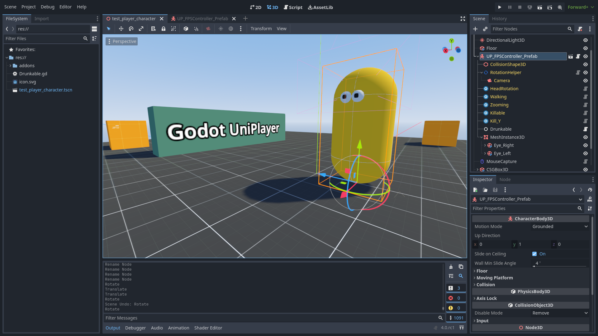

# godot-uniplayer

Modular player controller for Godot 4

## Highlights

* Build your own player controller from small components
* Create custom abilities and behaviours
* Use one of the available prefab: FPS Human, FPS FlyingMachine, etc.
* Customize prefab by adding custom behaviours
* Duplicate built-in prefab and customize it to fit your needs without feature loss
* Use in your commercial work thanks to permissive license
* Allows to use custom meshes and collision shapes

## Installation

* Copy `addons/uniplayer` to the project's `addons` directory
* Enable `UniPlayer` plugin in your project (AssetLib -> Plugins)

## Usage

### Use prefabs

1. Create or open existing scene
2. Clisk "chain" icon (Instantiate Child Scene) and search for "FPS"
3. Select `FPS_Human_Controller`

### Customize built-in prefabs

1. Tune properties exposed in the prefab
2. Add more abilities as child nodes to the prefab instance
3. Make it local and change anything you wish (remove / add abilities or behaviours)
4. Extend the prefab with your custom class, add properties and implement features you need

### Create custom character controller

1. Extend `UP_BasePlayer` class
2. Add `RotationHelper` and camera as it's child
3. Add abilities and behaviours you need

## F.A.Q.

* [I added an abilitiy, but it does not work](#i-added-an-abilitiy-but-it-does-not-work)
* [What's the difference between abilities and behaviours?](#whats-the-difference-between-abilities-and-behaviours)
* [Is RigidBody-like character supported?](#)
* [Can I use UniPlayer for controlling a vehicle?](#)
* [Can I build specialized controller top of this plugin?](#)
* [Can I use the plugin in my commercial product?](#)

#### I added an abilitiy, but it does not work.

The selected ability may require assigning a proper node (RotationHelper, Camera, other ability or behaviour).

#### What's the difference between abilities and behaviours?

Currently the difference is only in naming things. Abilities and behaviours extends same `UP_BaseAbility` class.

#### Is RigidBody-like character supported?

Currently all abilities are designed only to work with `CharacterBody3D`. This is requirement of the `UP_BaseAbility`.
This may change in the future.

#### Can I use UniPlayer for controlling a vehicle?

This is theoretically possible and probably will be, but not in the current version.

### Can I build specialized controller top of this plugin?

Definitely. I highly recommend using the plugin as a lightweight base for more complex controllers.

### Can I use the plugin in my commercial product?

Yes. You may note the autor somewhere and add link to this repository.

## Built-ins

### Abilities

####  HeadRotation

Adds ability to control the player's head by mouse.

####  Walk

* walk
* run
* jump
* crouch
* fall down
* footsteps

####  Zoom

* camera zoom on demand

### Behaviours

####  HealthRegeneration

 * player's health regeneration at specified intervals

####  Killable

 * killable player
 * respawning
 * tracking last "good" position
 * multiple respawn strategies:
    - disable controls and leave player died
    - respawn at initial level position
    - respawn at last known "good" position
    - just emit a special signal
    - quit the game

####  Kill_Y

 * kill player based on world's Y coordinate
 * override respawn strategy or use default

### Prefabs

####  FPS_Human_Controller

 * FPS human-like being with typical abilities and behaviours.

### Tools

####  RotationHelper

Use as a parent node for the player's camera. It is not mandatory, but many built-in abilities are based on this node.

####  MouseCapture

Add this to your scene for toggling mouse capture by ESC key.

## Known bugs

* `HeadRotation` has no rotation limitations
* In the editor's class/nodes browser, the custom types are registered directly under `Node` and aren't grouped

## To do

* possibly rename the project
* documentation
* tutorials
* more useful abilities

----

*Time is money. Do not waste it for bloatware.*
